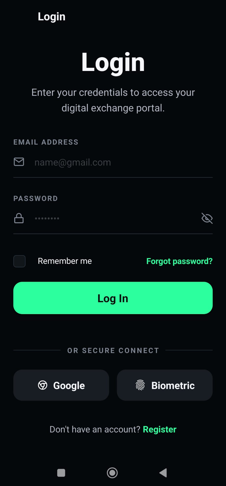
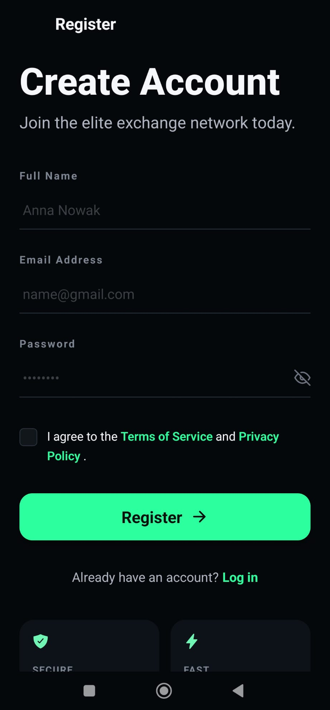
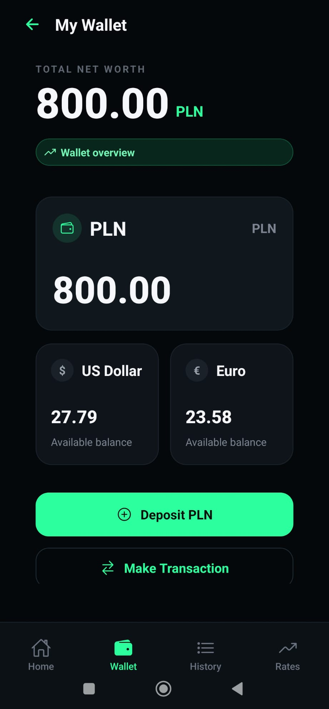
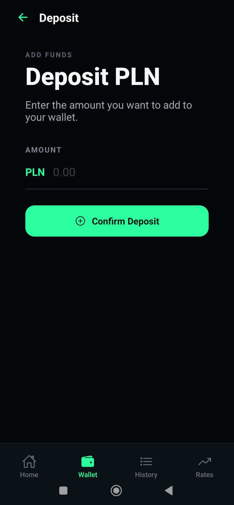
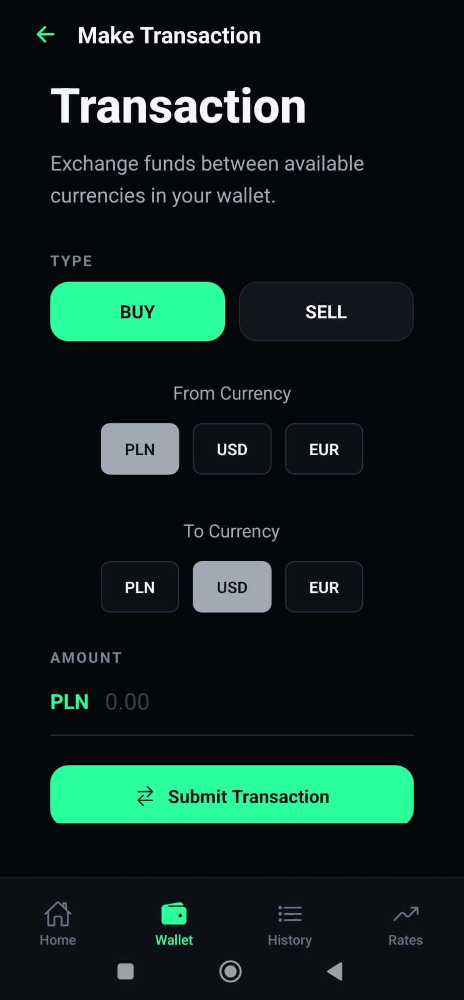
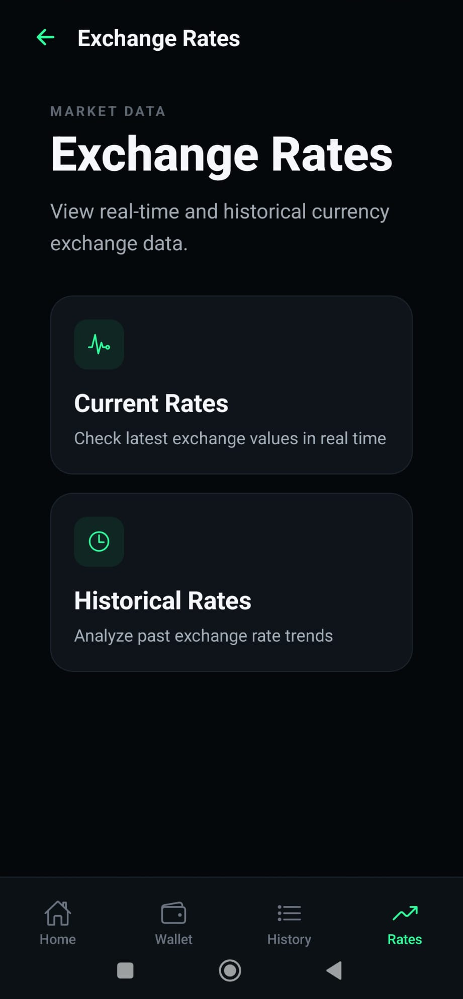
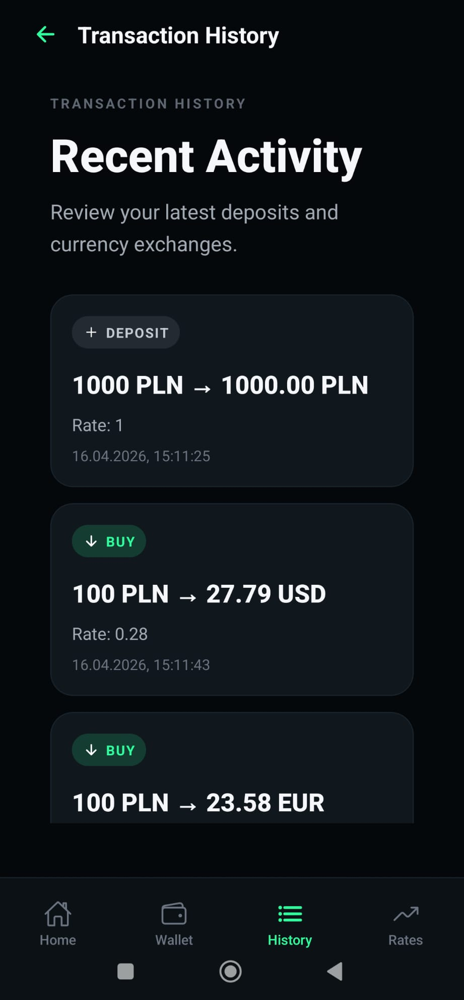

# Currency Exchange App (React Native + Node.js)

A **mobile currency exchange application** that allows users to manage a multi-currency wallet and exchange currencies using **official NBP exchange rates**.  
Built with **React Native (Expo)** on the frontend and a **Node.js / Express** backend with **JWT authentication**.

✅ User authentication (register & login)  
✅ Multi-currency wallet (PLN / USD / EUR)  
✅ Currency exchange (BUY / SELL)  
✅ Current & historical exchange rates (NBP API)  
✅ Clean, mobile-first UI

---

## Screenshots

### Authentication

| Login                           | Register                              |
| ------------------------------- | ------------------------------------- |
|  |  |

---

### Wallet & Transactions

| Wallet                            | Deposit PLN                         | Make Transaction                            |
| --------------------------------- | ----------------------------------- | ------------------------------------------- |
|  |  |  |

---

### Exchange Rates

| Current Rates                                   | Historical Rates                                      |
| ----------------------------------------------- | ----------------------------------------------------- |
|  |  |

---

## Features

### Wallet & Transactions

- User wallet with balances for:
  - PLN
  - USD
  - EUR
- Deposit PLN to wallet
- Currency exchange:
  - **BUY** currencies using PLN
  - **SELL** currencies back to PLN
- Client-side validation:
  - positive amounts
  - max 2 decimal places
  - different currency pairs

### Exchange Rates (NBP API)

- **Current exchange rates**
- **Historical exchange rates** for selected currency and date range
- Rates based on **official National Bank of Poland (NBP) data**

### Authentication

- User registration & login
- JWT-based authentication
- Protected API routes
- Authorization using Bearer token

---

## Tech Stack

### Frontend

- React Native (Expo)
- React Navigation
- Axios
- Context API (authentication state)

### Backend

- Node.js
- Express
- MongoDB (Mongoose)
- **MongoDB Atlas (cloud database)**
- JWT Authentication
- Express middleware (CORS, validation)

### External API

- National Bank of Poland (NBP) Exchange Rates API

---

## Architecture Overview

- The **Express backend** handles:
  - authentication
  - wallet logic
  - transactions
  - fetching exchange rates from the NBP API
- The **React Native frontend** communicates with the backend using a centralized Axios client.
- Authentication is handled using JWT tokens.
- Currency exchange logic is implemented on the backend to ensure data consistency and security.

---

## Getting Started (Local)

### 1. Clone repository

```bash
git clone https://github.com/kacpi95/Currency-_exchange_Native-.git
cd currency-exchange-app
```

### 2. Backend setup

```bash
cd backend
npm install
touch .env
npm run dev
```

### 3. Backend .env

```bash
MONGO_URI=mongodb+srv://<user>:<password>@cluster.mongodb.net/database
JWT_SECRET=your_jwt_secret
PORT=5000
```

### 4. Frontend setup

```bash
cd frontend
npm install
touch .env
npx expo start
```

### 5. Frontend .env

```bash
EXPO_PUBLIC_API_BASE_URL=http://YOUR_LOCAL_IP:5000
```

## API Endpoints (example)

- Deployed as a fullstack app on Render (Express serves frontend or runs alongside it).
- Make sure API_URL in your frontend service points to your deployed backend.

### Example:

- POST /api/user/register
- POST /api/user/login
- GET /api/wallet
- POST /api/wallet/deposit
- POST /api/transactions
- GET /api/current
- GET /api/history/:currency/:start/:end

### Notes

- Exchange rates are based on official NBP data.
- Business logic is handled on the backend to prevent invalid wallet states.
- The project was built as a portfolio project to demonstrate fullstack mobile development skills.

## What I Learned

This project helped me gain hands-on experience in building a production-like mobile application with a real backend and external API integration.

### Frontend (React Native)

- Building a multi-screen mobile app using React Navigation
- Managing authentication state with Context API
- Handling API communication with Axios
- Implementing form validation and loading states
- Creating a clean, mobile-first UI

### Backend & API

- Designing REST API endpoints with Express
- Implementing JWT authentication
- Structuring MongoDB models with Mongoose
- Integrating external APIs (NBP)
- Handling errors and edge cases in business logic
